# neighborChat
Project for NYU-CS-6083-Fall-2019

- Overview
    - This project is designed to let neighbors chat and make socials through Internet. It's like a tiny Facebook for neightbors.
    - Tech Stack: SpringBoot, Java

- Functional Designs
    1. Users should register for the service, specify where they live, post profiles, introduce themselves, upload photos and specify neighbors.
    2. In the website, there are two levels of locality, hoods and blocks. Both cannot be created by users and are modeled as axis-aligned rectangles that can be defined by two corner points.
    3. Users can apply to join a block, and they are accepted as a new member if at least three existing members or all members if less than three approve. A user can only be in one block and automotically a member of hood in which the block is located.
    4. Members can specify two types of relationships (friends or neighbors)
    5. People can post, read and reply messages. A user can send message to a person who is a friend or a neighbor, or all of their friends, or entire block, or entire hood they are a member of. Reply can be read and replied by anyone who received the earlier message. Feeds can be separated.
    6. System can show only threads with new messages since the last time visited, or profiles of new members, or threads with new messages unread.
    7. Users can move to another block

- Database E-R Diagram
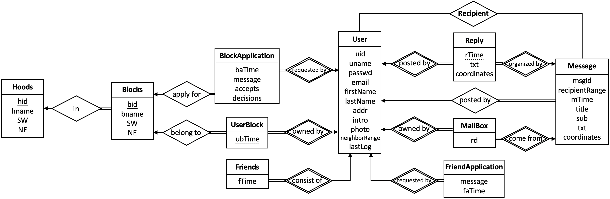

- Business Design
    - User
        - Register
        - Log In & Auth (cookie & session)
        - Forget Password (reset)
        - Info
    - Load Data
        - Users
            - Neighbor list
            - Same building list
            - Stranger list
            - Same block list
            - Same hood list
        - Membership
            - By block
            - By hood
        - Message
            - From particular
            - From friend
            - From neighbors
            - From block
            - From hood
    - Membership
        - Apply for new block (membership)
        - Accept / refuse application
        - Exit block (membership)
    - Relationship
        - Query all friends / neighbors / strangers nearby
        - Apply for new friend
        - List / accept / reject friend application
        - Add new neighbor
        - Delete friend / neighbor
    - Message
        - Query all messages and replies
        - Divide into particular / friends / neighbors / all block / all hood
        - Write new message
        - Write new reply
    - Notification
        - Notify new block / friend application
        - Notify accepted/rejected block/friend application
        - Notify new message / reply

- Some features
    - XSS Protection: Use Jsoup to rewrite HttpServletRequest
    - SQL Injection Protection: Use  MyBatis to precompile SQLs
    - SHA 256-Encryption: Use Apache.common-decodec to encrypt password
    - Transaction: Use Spring Boot Annotation to make essential functions transactional
    - User Auth: Use cookie to do user authentication and session to memorize user

- Background Architecture
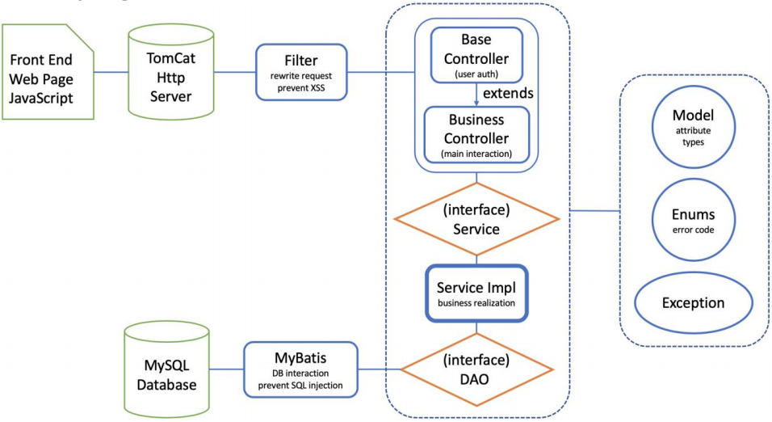

- Frontend Design
    - Register
        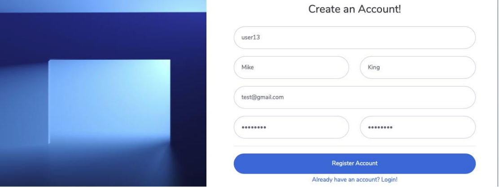
    - Login
        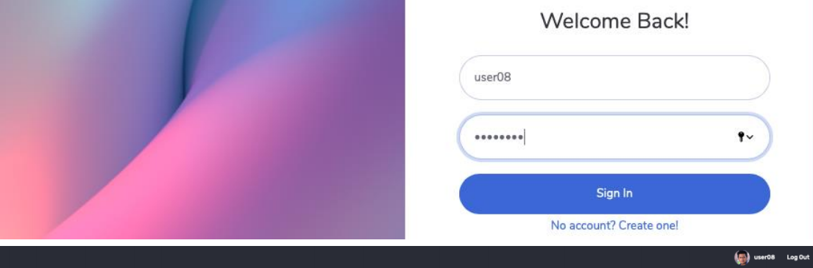
    - Dashboard
        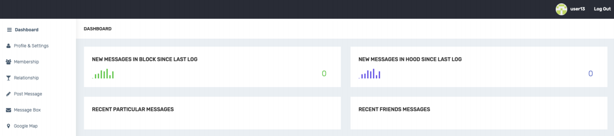
    - Profile
        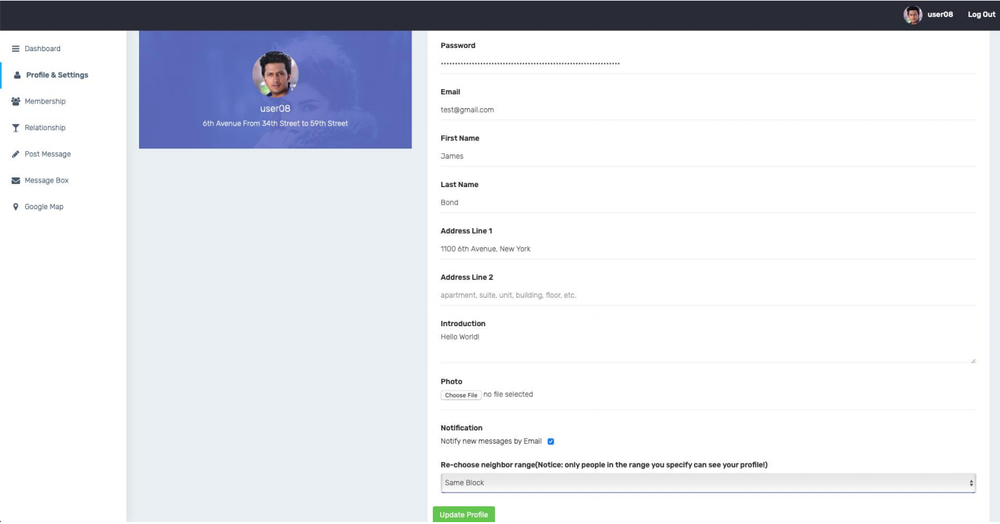
    - Membership
        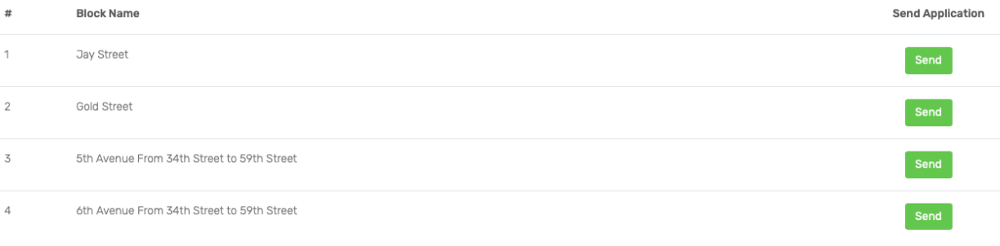
        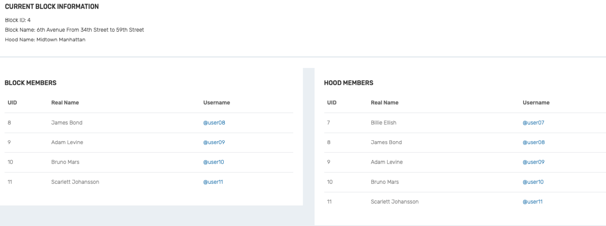
    - Relationship
        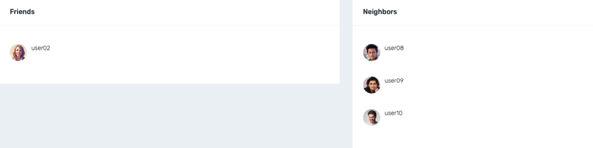
        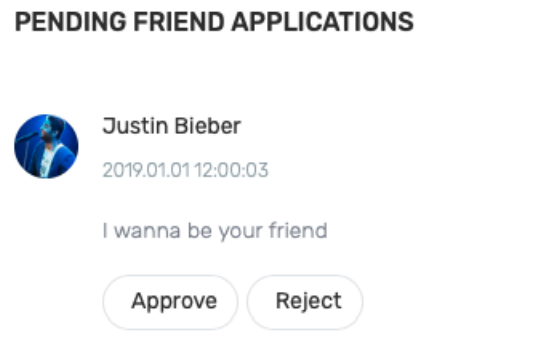        
    - Post
        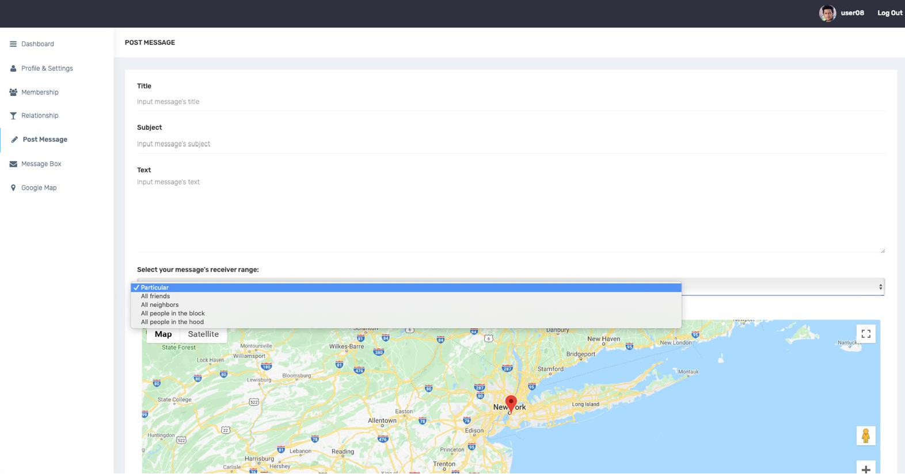
    - Message
        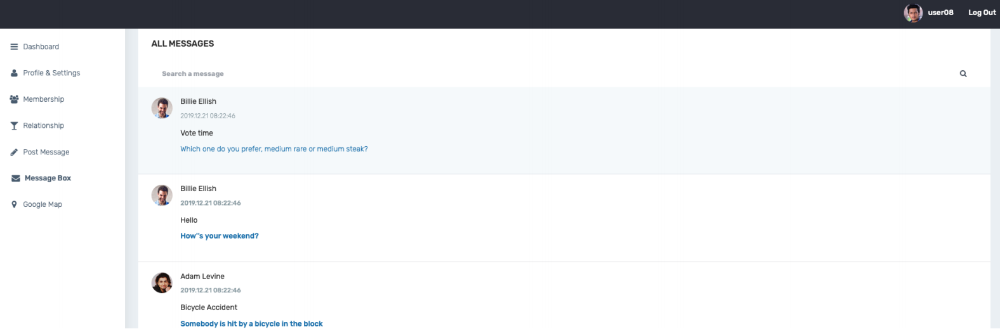
        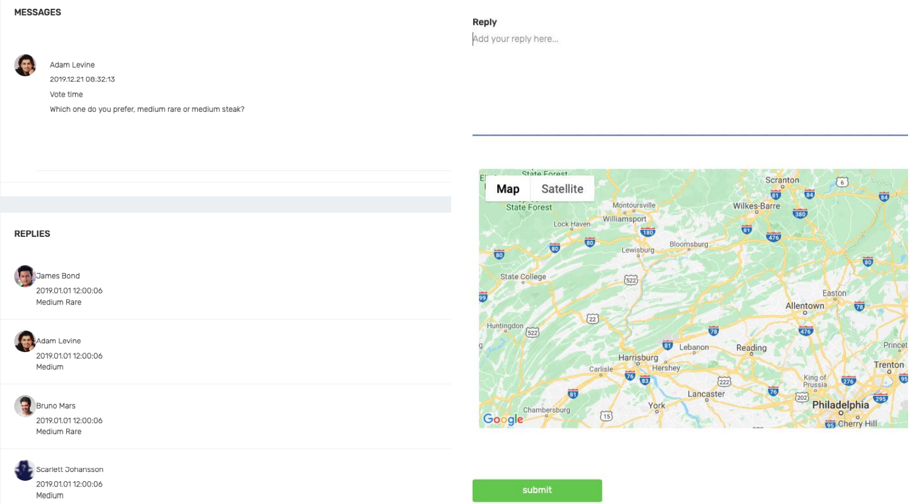

- [Full Report](DB_Project_Report.pdf)

- Full Instructions
    - [Instruction1](pro1.pdf)

    - [Instruction2](pro2.pdf)

- Database 
    - [Build Database](createDB.sql)

    - [Sample Data](sampleData.sql)